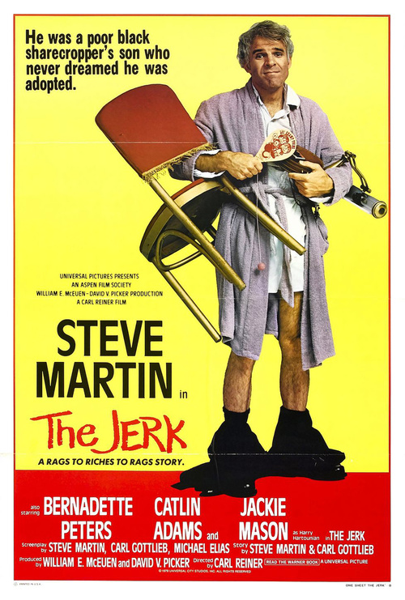

# Lessons from The Jerk

If you're not familiar with [The Jerk (1978)](imdb) starring Steve Martin, do yourself (well really, do _me_ a favor) and watch it. It's streaming on Amazon Video. Just go watch it. I'll wait.

Now that you're back, I want to share 3 very important pieces of advice that Maven Johnson, the star of our story, receives from his loving family before he departs on his Hero's Journey:

1. The Lord loves a working man
2. Don't trust whitey
3. See a doctor and get rid of it

**This is universally good advice.**

I may not believe in any higher power, but showing up and a willingness to work gives you more advantages than not.

I may not be anything other than an average white american man, but I sure as hell don't trust any authority figure. It's a reasonable precautionary measure.

And I may not follow all good advice, but seriously you should see a doctor every once in a while. And call your mom.

I first saw these painted on a plaque in a tattoo shop in Boulder, completely removed from their context in The Jerk, which I had already seen but didn't connect at the time. I had remembered the signage despite missing the connection to the film. I re-watched it last week and finally noticed, and reveled in the warmth of a pop-culture reference coming full circle: it was a moment of life's weird interconnected on full display. I spent a lot of time in that tattoo shop.
